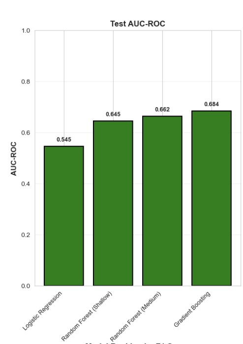

# Merkin_FinalProject

## Project Title: Finding the best model to predict transition metal oxide stability

## Scientific Question

Which type of machine learning model is best for predicting transition metal oxide stability?

## Data

All data for this project comes from Materials Project API. Access is recieved through the notebooks.

[1]M. K. Horton et al., “Accelerated data-driven materials science with the Materials Project,” Nature Materials, July 2025, doi: 10.1038/s41563-025-02272-0.
[2]A. Jain et al., “Commentary: The Materials Project: A materials genome approach to accelerating materials innovation,” APL Materials, vol. 1, no. 1, p. 011002, July 2013, doi: 10.1063/1.4812323.

## Quick Start

### Prerequisites

- Conda (Miniconda or Anaconda)
- Git

### Installation

1. Clone the repository:
```bash
git clone https://github.com/benbenmerk-stack/Merkin_FinalProject.git
cd Merkin_FinalProject
```

2. Create the conda environment:
```bash
conda env create -f environment.yml
```

3. Activate the environment:
```bash
conda activate matds
```

4. Launch Jupyter Lab:
```bash
jupyter lab
```

## Project Structure

```
Merkin_FinalProject/
├── README.md                          # This file
├── environment.yml                    # Conda environment specification
├── .gitignore                         # Git ignore rules
├── notebooks/                         # Jupyter notebooks for analysis pipeline
│   ├── 01_data_acquisition.ipynb     # Fetch data from materials APIs
│   ├── 02_eda_featurization.ipynb    # Exploratory analysis & feature engineering
│   ├── 03_modeling.ipynb             # Model development & training
│   └── 04_results_visualization.ipynb # Results analysis & visualization
└── data/                              # Data directory
    ├── README.md                      # Dataset documentation
    ├── *.csv                          # Processed datasets
    └── figures/                       # Generated plots & visualizations
```

## Workflow

1. **Data Acquisition** (`01_data_acquisition.ipynb`): Retrieve materials data from sources like Materials Project API, JARVIS, etc.
2. **EDA & Featurization** (`02_eda_featurization.ipynb`): Explore data distributions, identify patterns, engineer features for modeling
3. **Modeling** (`03_modeling.ipynb`): Train and evaluate machine learning models
4. **Results & Visualization** (`04_results_visualization.ipynb`): Interpret results and create publication-quality figures


## Summary of Key Results

I compared random forests (shallow and medium), gradient boosting, and logistic regression models. Going by the AUC, the best model was a gradient boosting model, at 0.684. This model also had the best precision and good accuracy, though its recall was weaker. Overall all the models performed better than random. I also found that the average deviation Mendeleev Number is the feature of greatest importance here when predicting material stability.



## Resources

Copilot was used in helping to generate and debug the code for this project.